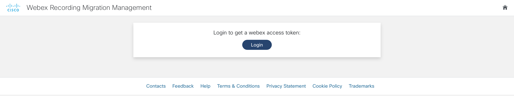
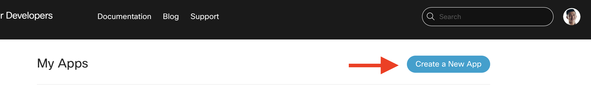

# GVE DevNet Webex Recording Migration Management

Please note: this repository is an adaptation of the [Webex Recordings to AWS App](https://github.com/gve-sw/gve_devnet_webex_recordings_to_aws). We have also implemented a "bulk" mode to be able to copy or migrate all recordings for all users in the organization the admin user belongs to.

Cisco Webex is THE unified app for the future of work, where you can call, meet, collaborate and message. Webex allows you to record meetings if needed and the Webex cloud stores recordings by default up to one year and with a maximum of 10 years. However, some customers are required by law to store recordings for a longer period of time. One solution would be to migrate the recordings to the AWS cloud.

By using the Webex and AWS API, we have created a Flask application that integrates the two solutions and allows the user to migrate recordings from the Webex cloud to the AWS cloud. We can migrate the recordings in a few simple steps:

0. First, we have to login and obtain our Webex access token:



1. After having logged in and authorized the application, we should select the `siteUrl`, the `period` and the `hostEmail` that we are interested in.


2. Then, we will obtain a table of all the recordings that are available and it will be immediately indicated if the Webex recording has been copied or migrated from the Webex cloud or not:


3. When you have selected the recordings that you would like to migrate, you can press the button `Migrate` (`Copy` if you have set the environment variables to no migrate) to start the copy or migration process and afterwards you will get a summary of the recordings that have been processed:


4. The process above is mainly manual, but in some use cases, we would like to automate the whole flow. In that case, we can create a scheduler that will migrate all the recordings in a certain period based on a daily, weekly, biweekly or monthly frequency:


Please note: the scheduler's back-end has not been fully implemented. The front-end serves as a mock-up and inspiration on how to do an automated flow of this use case.

5. If you use the "bulk" option by using the URL for the Flask application and appending "/bulk", you will obtain the same admin login page but then you will be presented with the following page where you will
   only be able to select the `siteUrl` and the `period`. After that, if you click on the "Retrieve All" button, all recordings for all users for that period will be copied to migrated from the Webex cloud to AWS or local storage depending on how you set up the corresponding environment variables:


## Contacts

- Simon Fang (sifang@cisco.com)
- Gerardo Chaves (gchaves@cisco.com)

## Solution Components

- Webex
- Flask
- Python
- AWS

## Prerequisites

- Webex OAuth Integration
- AWS S3 Storage (for cloud storage instead of local filesystem)
- Webex Account

## How to register your own Webex OAuth integration

Registering an integration with Webex is easy and can be done in a couple of steps. If you have already registered your Webex OAuth integration with the right scopes, then you can skip this step.

1. First, head over to developer.webex.com and log in:


2. After having logged in, click on your avatar and select `My Webex Apps` from the menu under your avatar.


3. On the new page, click `Create a New App` in the top right corner:



4. Then, click `Create an Integration` to start the wizard:


5. In the wizard, fill in the form fields:

   - **Name:** The name of the app, e.g. My Webex Integration
   - **Icon:**: Choose an icon or upload an icon
   - **Description:** Explain what your integration can do. Note that these details are not displayed to the end-users of the integration
   - **Redirect URI(s):** Important! The Redirect URI has to match with the `webex_integration_redirect_uri` in the `.env` file. In our case, this will be `"http://127.0.0.1:5000/webexoauth"`
   - **Scopes:** We have to define the level of access that our integration requires. For our app, we require the following scopes:

     - `meeting:recordings_read`
     - `spark:kms`
     - `meeting:admin_recordings_write`
     - `spark-admin:organizations_write`
     - `spark-admin:people_write`
     - `meeting:recordings_write`
     - `meeting:admin_recordings_read`
     - `spark-admin:organizations_read`
     - `spark-admin:people_read`
     - `meeting:preferences_read`


6. After having filled in the details, click on `Add integration` and you will be taken to the next page, where you will be given the `Client ID` and `Client Secret` along with the OAuth Authorization URL. It is important to copy and store the `Client Secret` in a safe place as it will be generated and displayed only once for security purposes. In case you lose it, then a new client secret will be regenerated:


> Note: the documentation for Webex integrations can be found [here](https://developer.webex.com/docs/integrations)

## AWS S3 Storage (Optional)

Next, we can create AWS S3 storage, if you wish to migrate or copy the Webex recordings to. In case you have already set up S3 storage and obtained the API credentials, then you can skip this step.

1. Sign in to the AWS Management Console and open the Amazon S3 console at https://console.aws.amazon.com/s3/.

2. Choose **Create bucket** and the wizard opens to guide you through.


3. Choose a **Bucket name** that is DNS-compliant. The bucket name must be:

   - Be unique across all of Amazon S3
   - Be between 3 and 63 characters long
   - Only lowercase letters
   - Start with a lowercase letter or number

4. Choose the **AWS Region**. The closer the region, the lower the latency. Take a note of both the **Bucket name** and **AWS Region**, which will have to be stored in our environment variables.


5. All other options may remain enabled in its default values. Finalize the process by choosing **Create bucket**.


> Note: the instructions on how to create a bucket in S3 storage can be found [here](https://docs.aws.amazon.com/AmazonS3/latest/userguide/create-bucket-overview.html)

6. After having successfully created a bucket in S3 Storage, we have to create a set of access keys for API access. Log in to the AWS Management Console and head over to the IAM console: https://console.aws.amazon.com/iamv2/home

7. Click on **Users** and then **Add users**


8. In the wizard, select a **User name** and select **Access key - Programmatic access** for the AWS access type.


9. In the next step, grant the permissions and optionally add tags.

10. In the last step, review all the changes and confirm. Then, you will be shown the **Acces key ID** and the **Secret access key**. Store the set of keys in a safe place and add them later into our environment variables.


> Note: the instructions on how to obtain _programmatic access keys_ in AWS can be found [here](https://docs.aws.amazon.com/general/latest/gr/aws-sec-cred-types.html)

## Installation/Configuration

The following commands are executed in the terminal.

1.  Create and activate a virtual environment for the project:

        #WINDOWS:
        $ py -3 -m venv [add_name_of_virtual_environment_here]
        $ [add_name_of_virtual_environment_here]/Scripts/activate.bat
        #MAC:
        $ python3 -m venv [add_name_of_virtual_environment_here]
        $ source [add_name_of_virtual_environment_here]/bin/activate

> For more information about virtual environments, please click [here](https://docs.python.org/3/tutorial/venv.html)

2.  Access the created virtual environment folder

        $ cd [add_name_of_virtual_environment_here]

3.  Clone this repository

        $ git clone [add_link_to_repository_here]

4.  Access the folder `GVE_DevNet_Webex_Recording_Migration_Management`

        $ cd GVE_DevNet_Webex_Recording_Migration_Management

5.  Install the dependencies:

        $ pip install -r requirements.txt

6.  Open the `.env` file and add the environment variables. In the sections above, it is explained how to obtain these credentials and variables. Please note that all the variables below are strings.

    ```python
    # Webex integration credentials
    webex_integration_client_id = "<insert_webex_integration_client_id>"
    webex_integration_client_secret= "<insertwebex_integration_client_secret>"
    webex_integration_redirect_uri = "http://127.0.0.1:5500/webexoauth"
    webex_integration_scope = "meeting:recordings_read spark:kms meeting:admin_recordings_write spark-admin:organizations_write spark-admin:people_write meeting:recordings_write meeting:admin_recordings_read spark-admin:organizations_read spark-admin:people_read meeting:preferences_read"

    # AWS Variables
    AWS_ACCESS_KEY_ID = "<insert_AWS_ACCESS_KEY_ID>"
    AWS_SECRET_ACCESS_KEY = "<insert_AWS_SECRET_ACCESS_KEY>"
    REGION_NAME = "<insert_REGION_NAME>"
    BUCKET_NAME = "<insert_BUCKET_NAME>"

    # Local storage variable
    DOWNLOAD_FOLDER = "<insert local folder path here (optional)>"

    # Flag to indicate if it should delete after copying to perform a true migration
    MIGRATE_RECORDINGS = "True"

    # String to use as filter when pulling entire directory for bulk mode. Only users with names that start with that string
    # will be processed. Minimum 3 characters
    BULK_NAME_FILTER = ""
    ```

If you wish to use a local filesystem or local network location to download the Webex Meetings recordings,
leave the `AWS_ACCESS_KEY_ID` environment variable blank and fill out `DOWNLOAD_FOLDER` environment variable with the path to the local directory to use.  
Also, if you do not wish to delete the recordings from the Webex cloud and therefore "copy" instead of "migrate" those recordings, please set the
MIGRATE_RECORDINGS environment variable to "False".

If you wish to use the "bulk" mode described below and have a very large organization with hundreds or thousands of users, you can fill out the `BULK_NAME_FILTER` environment variable with at least the first 3 letters of the name of the users you are interested in procesing for either testing purposes or targeting a specific user to download all of their recordings without having to select them all from the web interface. Leave it blank to always process the entire list of users.

## Usage

Now it is time to launch the application! Simply type in the following command in your terminal:

    $ python app.py

Then, head over to the URL that is displayed in the terminal output. For example:

```
http://127.0.0.1:5500/
```

The downloaded or migrated recordings obtained using this URL will use filenames with the format `{meeting topic}---{recording id}.mp4`

If you wish to bulk download recordings for all users for a selected time period, you need to append `bulk` to the url to bring up the corresponding web interface for bulk operations.  
For example:

```
http://127.0.0.1:5500/bulk
```

The downloaded or migrated recordings obtained using this "bulk" URL will use filenames with the format `{host Name}-{time recorded}---{recording id}.mp4`

Please note: If running on MacOS, if you get the following error in the console where you are running the flask application:

```
<urlopen error [SSL: CERTIFICATE_VERIFY_FAILED] certificate verify failed: self signed certificate in certificate chain (\_ssl.c:997)>
```

Stop the application and run `\Applications\Python 3.10\Install Certificates.command` to install the CA Root certificate Python needs. (adjust the Python version as necessary)


### LICENSE

Provided under Cisco Sample Code License, for details see [LICENSE](LICENSE.md)

### CODE_OF_CONDUCT

Our code of conduct is available [here](CODE_OF_CONDUCT.md)

### CONTRIBUTING

See our contributing guidelines [here](CONTRIBUTING.md)

#### DISCLAIMER:

<b>Please note:</b> This script is meant for demo purposes only. All tools/ scripts in this repo are released for use "AS IS" without any warranties of any kind, including, but not limited to their installation, use, or performance. Any use of these scripts and tools is at your own risk. There is no guarantee that they have been through thorough testing in a comparable environment and we are not responsible for any damage or data loss incurred with their use.
You are responsible for reviewing and testing any scripts you run thoroughly before use in any non-testing environment.
